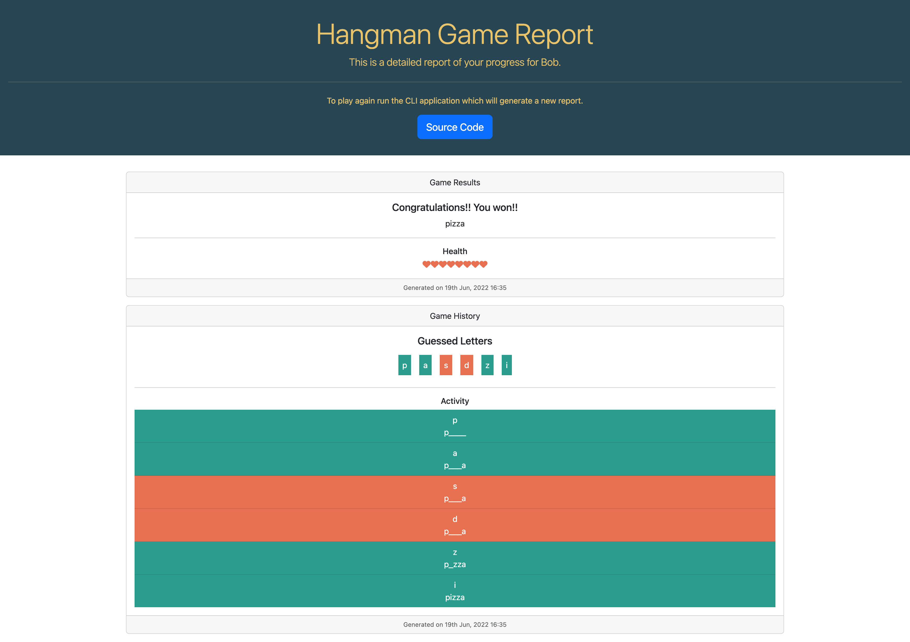

# CLI Hangman Game

## Your Task

Build a command line interface application that allows users to play the famous word game of Hangman.

## User Story 1

```
AS a user I should be able to set the game settings before I commence the game
```

### Acceptance Criteria

```
AS a user
WHEN I start the CLI application
THEN I am presented with a question "Please enter your nickname:"
AND WHEN I enter a value and hit enter
THEN I am presented with a question containing the user's nickname "<NICKNAME>, please choose a category:" with a default value of Movies
AND WHEN I select one the following options: Movies, Food, Sports, Places
THEN I am presented with a question containing the user's nickname "<NICKNAME>, please choose a level:" with a default value of Easy
AND WHEN I select one of the following options: Easy, Medium, Hard
THEN I am presented with a question containing the user's nickname "<NICKNAME>, please choose a mode of play:" with a default value of Letter Input
AND WHEN I select one of the following options: Letter Input, Letter Choice
THEN I am presented with a question containing the user's nickname "<NICKNAME>, would you like to generate a game report?" with a default value of Yes
```

## User Story 2

```
AS a user I should be able to play the game with the applied settings
```

### Acceptance Criteria

```
AS a user I should see the masked word and my health status as soon as the game begins
AND THEN I should be presented with a question containing the user's nickname "<NICKNAME>, please enter a letter from a-z:" if the user had selected the game mode as Letter Input
OR I should be presented with a question containing the user's nickname "<NICKNAME>, please select a letter from a-z: if the user had selected the game mode as Letter Choice and a list if characters from a-z will be presented as choices
AND WHEN I enter a character that exists in the word then the all occurrences of the character is revealed
AND WHEN I enter a character that does not exist in the word then I will lose a life which is will be displayed
AND WHEN I lose all remaining lives of 10 then the game is over and the game status is displayed
AND WHEN I guess all the characters with remaining lives then I win the game and the game status is displayed
```

## User Story 3

```
AS a user I should be able to view the generated HTML game report
```

### Acceptance Criteria

```
WHEN I have selected Yes for the generation of the game report
THEN I should see a game report automatically open when the game is complete
AND it should render every stage of the game played which includes the character guessed and the letters masked and unmasked
AND display the game status
AND display the remaining lives
AND the report must open in the browser automatically
```

### Screenshot


